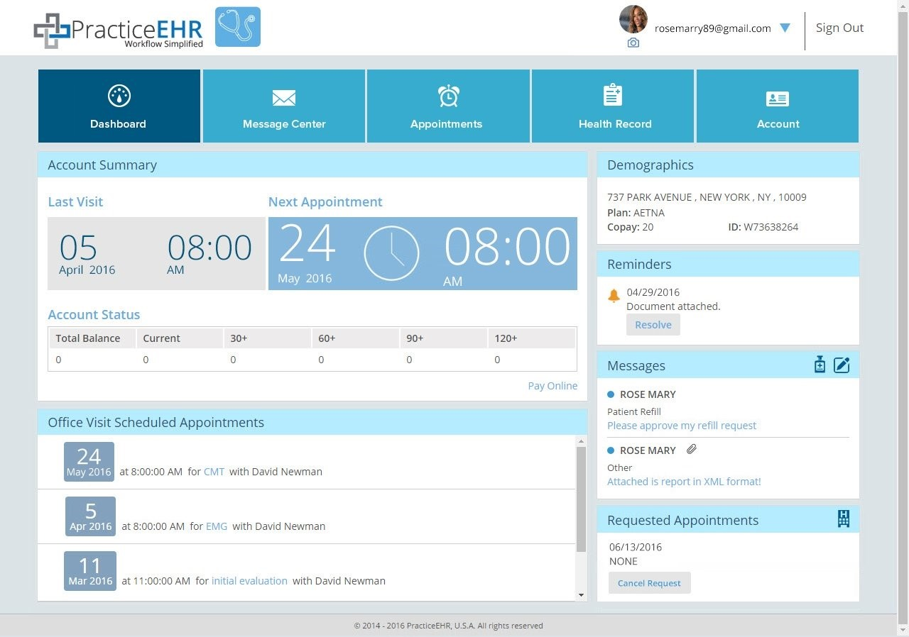

# CS673-HealthcommunicationPortal

Patients love your free portal- it lets them conveniently and securely communicate with you and access their records anytime and anywhere. Our patient portal is fully integrated with EHR saving your staff’s phone time and minimizes distractions as lab results sharing, prescription refill requests, and appointment requests can be handled from within the EHR.

  

## CONTRIBUTORS 
1. Manjushree Rao - Devops
2. Ashray Kengunte Jayachandra - Data Architect
3. Prajwal Shiva Kumar - UI/UX Developer
4. Suvarna Patil - Microservice Developer
5. Neha Mulgund - Business Analyst

## GIT Repository Link
[HealthcommunicationPortal](https://github.com/ManjushreeRao/CS673-HealthcommunicationPortal)

## About The Project
Data Architecture -Every product collects some data that is stored inside a database in the form of facts and dimensions and also involves transactional data of day to day life. In this product, we are mainly concentrating in the data collected by the hospital and the patients who cannot arrive at the hospital and portray a user friendly portal that describes the medical ailment involved and their daily health proceedings with correct medicines as suggested by the Doctor in the prescription. Everything is stored in Heroku cloud and the data will be fetched using PostgreSQL. 

## Far Vision 
  Our goal is make sure we meet the following requirements for the client:
  Exchange secure messages.
  Request appointments, prescriptions and refills.
  Access always up-to-date personal healthcare records (PHR) including medications, lab results, diagnoses, care plans, immunization histories, and more.
  Quick access to additional healthcare information and educational material related to their diagnosis.
  Receive automated reminders, alerts, HIPAA compliance notices, and other important announcements.
  View statements and make payments.
  Our patient portal facilitates meaningful compliance.
  Easy setup- simply enter patient email and enable portal. 
  An invitation email with instructions to your patients is automatically sent out.

## Near Vision
  We will be working towards having a poratl that is connected to the database which shows the up-to-date personal healthcare records (PHR) including medications, lab results,     diagnoses, care plans, immunization histories, and more.
<table>
  <tr>
    <th>Company</th>
    <th>Contact</th>
    <th>Country</th>
  </tr>
  <tr>
    <td>Alfreds Futterkiste</td>
    <td>Maria Anders</td>
    <td>Germany</td>
  </tr>
  <tr>
    <td>Centro comercial Moctezuma</td>
    <td>Francisco Chang</td>
    <td>Mexico</td>
  </tr>
</table>
  
## Product Backlogs
  User story1: Database craetion- Setting up the Heroku database.
  User story2. Creating a UI/UX framework and design for user friendly portal.
  User story3. Creating schema of facts and dimensions table.
  User story4. Inserting sample data into the tables.
  User story5. Displaying the personal healthcare records (PHR).
  User story6. Displaying appoinment details on the portal.
  User story7. Displaying the medicine available.
  User story8. Integration between database and UI/UX design for the portal.
  User story9.
  User story10.

  
## Stake holder types
  1. Access to healthcare records
  2. Access to doctor information based on the specilization.
  3. Access to medicine availability.
  
  

